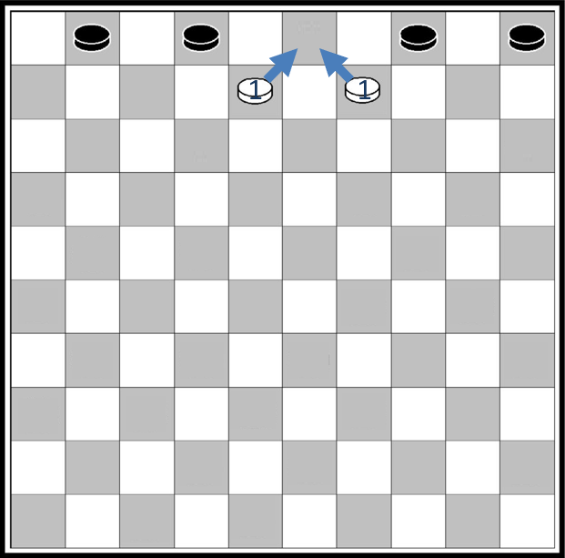

# Programmation dynamique

## Un exemple simple

{width=30% align=right}
Le jeu de Dames se pratique sur un damier de 10 cases sur 10. Les pions sont placés sur les cases foncées et ne peuvent se déplacer que d'une case à la fois, toujours vers l'avant en diagonale. Une des stratégies du jeu consiste à amener un pion sur la dernière rangée pour être promu en dame. 

La question est la suivante :  Sur le damier ci-contre, combien de chemins peut emprunter le pion blanc depuis cette case de départ pour arriver à la case vide sur la rangée du haut et être promu en dame ? 

Si on essaie de compter tous les chemins on risque de vite perdre le compte. Une idée simple pour répondre à ce problème efficacement consiste à noter à chaque intersection le nombre de chemin en partant de la fin. Découpons le processus en plusieurs étapes.

=== "Etape 1"

    On peut déjà observer qu'un certain nombre de cases ne peuvent pas être atteintes par le pion blanc depuis sa position de départ, ou ne peuvent pas mener à la case d'arrivée, on peut donc les exclure de nos calculs.

    {width=30%}

=== "Etape 2"
    Il n'y a que deux cases sur la deuxième rangée qui permettent d'aller sur la case d'arrivée, et pour chacune il n'y a qu'un seul chemin possible. 

    Marquons ces cases avec leur nombre de chemins possibles.

    
    {width=30%}

=== "Etape 3"
    Il y a trois cases sur la troisième rangée pouvant aller sur les deux cases précédentes. 
    
    Un pion sur la case à gauche ou celle à droite n'a qu'un seul chemin possible. 
    
    Par contre un pion sur la case au milieu peut soit se déplacer vers le haut à droite soit vers le haut à gauche. Dans les deux cas, il n'a plus qu'un chemin possible ensuite. Il y a donc deux chemins possibles au départ de cette case.
    
    {width=30%}


=== "Etape 4"
    Continuons à la rangée suivante. Comme dans la rangée précédente, un pion sur la case à gauche ou celle à droite n'a qu'un seul chemin possible.

    Les deux pions placés au milieu peuvent soit se déplacer vers le haut à droite soit vers le haut à gauche. Selon le choix que l'on fait, ils pourront emprunter 1 ou 2 chemins différents. Au total, il y a donc 3 chemins possibles au départ de ces deux cases. On comprend que le nombre de chemins possibles à partir d'une case est égal à  la somme des nombres de chemins au départ des cases à gauche et à droite de la rangée du dessus.


    **On a décomposé un problème en deux sous-problèmes plus simples**.
    
    {width=30%}


=== "Etape 5"
    Appliquons cette même idée à la rangée suivante, et notons le nombre de chemins possibles égal à la somme des nombres de chemins indiqués dans les cases à gauche et à droite sur la rangée du dessus.
    
    On constate le nombre de chemins calculé pour une case, par exemple 3, est utilisé deux fois : pour la case qui a 4 chemins possibles et pour la case qui a 6 chemins possibles.

    **Il faut donc garder en mémoire les résultats intermédiaires pour ne pas recalculer la même chose plusieurs fois**.

    
    {width=30%}

=== "Etape 6"
    Continuons à descendre dans le damier rangé par rangée en appliquant le même principe : pour chaque case on ajoute les nombres de chemins trouvés pour les cases à gauche et à droite de la rangée de dessus.  

    On arrive au résultat final : il y a  126 chemins possibles pour aller de la case de départ jusqu'à l'arrivée.

    
    {width=30%}


On peut observer deux choses dans la réalisation de cet algorithme : 

1.	Pour chaque case, il suffit de faire la somme du nombre chemins depuis la case de gauche et depuis la case de droite sur la rangée au-dessus : on **découpe le problème en sous-problèmes plus faciles à résoudre**.  

2.	Le nombre de chemin calculé pour une case est utilisé pour calculer les nombres de chemins de plusieurs cases. Les sous-problèmes se chevauchent. Il faut **garder en mémoire les résultats intermédiaires pour ne pas recalculer la même chose plusieurs fois**.

Ce sont les deux principes de la **programmation dynamique**.


!!! question "Exercice corrigé"
    Mario veut rejoindre la princesse Beach. Il ne peut se déplacer que vers la gauche et vers le haut, et ne peut jamais revenir en arrière. Combien de chemins différents peut-il emprunter ?

    {width=50%}
    {width=50%}


??? Success "Réponse"
    Notons à chaque intersection le nombre de chemin en partant de la fin. Pour chaque intersection, il suffit de faire la somme du nombre chemins depuis l‘intersection à sa gauche et des chemins depuis l'intersection au dessus.   

    {width=50%}
    {width=50%}


    Mario peut prendre 10 chemins différents.

!!! abstract "Cours" 
    La **programmation dynamique**[^4.1] résout un problème en combinant des solutions de **sous-problèmes qui se chevauchent**, c'est à dire qu'il possède des sous-sous-problèmes identiques.  
    
    Afin d'éviter les calculs redondants, **chaque sous-sous-problème n'est résolu qu'une seule fois et sa réponse est gardée en mémoire**.

[^4.1]:   Cette méthode a été introduite au début des années 1950 par Richard Bellman.  Le terme "programmation" dans "programmation dynamique", ne doit pas s'entendre comme "utilisation d'un langage de programmation", mais comme synonyme de planification et ordonnancement.

On peut voir la programmation dynamique comme une amélioration ou une adaptation de la méthode « diviser pour régner » puisqu'on divise un problème en sous problèmes, à la différence que la programmation dynamique s'applique quand les sous-problèmes se chevauchent, autrement dit un sous-problème peut être utilisé dans la solution de plusieurs sous-problèmes différents. Tandis que l'approche  « diviser pour régner » crée des sous-problèmes qui sont complètement séparés et peuvent être résolus indépendamment l'un de l'autre.

{width=80% }
{width=80% }

## Rendu de monnaie

Problème : On dispose d'un nombre illimité de pièces de ①, ②, ⑤ et ⑩ euros pour rendre une certaine somme. Quel est le plus petit nombre de pièces nécessaire ?

### Algorithme glouton

On a vu en classe de première une solution donnée par un algorithme glouton, qui consiste à faire, étape par étape, un choix optimum local, dans l'espoir d'obtenir un résultat optimum global : dans ce cas on choisit de façon répétitive la pièce de plus grande valeur qui ne dépasse pas la somme restante : 

=== "Programme itératif"

    ``` py
    pieces = [10, 5, 2, 1]

    def rendu_monnaie_gouton(x):
        nombre_pieces = 0
        i = 0 # on commence par la plus grande pièce
        while x > 0:
            if x >= pieces[i]: # on peut la rendre
                nombre_pieces += 1
                x = x - pieces[i]
            else:    # on passe à la pièce suivante
                i = i + 1
        return nombre_pieces	
    ```

=== "Programme récursif"
    ``` py
    pieces = [10, 5, 2, 1]

    def rendu(x, i=0):
        if x == 0: 
        return 0
        if pieces[i] <= x: 
            return 1 + rendu(x - pieces[i], i)
        return rendu(x, i + 1)
    ```


Testons l'algorithme glouton pour rendre 13 euros. On obtient bien les 3 pièces ⑩ + ② + ① qui font un total de 13.

``` py
>>> rendu_monnaie_gouton(13)
3
```

Mais que se passe-t-il si on n'a pas de pièce de 1 euro ? Remplaçons `pieces = [10, 5, 2]` et testons l'algorithme : 

```py
IndexError: list index out of range
```

Pourtant on peut rendre ⑤ + ② + ② + ② + ② qui font aussi un total de 13 euros !

C'est le **propre des algorithmes gloutons : une fois qu'une décision a été prise, on ne revient pas en arrière**. Dans certains cas l'algorithme ne trouve pas de solution, ou pas la meilleure solution.  Ici l'algorithme choisit la pièce de 10 euros qui ne mène à rien, il ne peut pas revenir en arrière et ressayer avec une autre pièce !

### Programmation dynamique

La programmation dynamique consiste à résoudre notre problème en combinant les solutions de sous-problèmes. Ici, rendre une somme x peut se faire de plusieurs manières  :

-	rendre x – 10 et rajouter une pièce de ⑩, ou
-	rendre x – 5 et rajouter une pièce de ⑤, ou
-	rendre x – 2 et rajouter une pièce de ②.

Dans notre exemple, pour rendre 13 euros on peut :

-	rendre 3 et rajouter une pièce de ⑩, ou
-	rendre 8 et rajouter une pièce de ⑤, ou
-	rendre 11 et rajouter une pièce de ②.

{width=80% }
{width=80% }


Chacun de ces sous-problèmes peut être résolus de la même façon. Constituons l'arbre des possibilités :

{width=80% }
{width=80% }

Certaines branches mènent à une solution, quand il reste 0 euros à rendre, d'autres pas. 

Implémentons cet algorithme en considérant trois cas :

-	Si x est égal à 0, alors on a rendu x, il n'y a pas de pièces supplémentaires à rendre, on renvoie 0.
-	Si x < la plus petite pièce, on ne pourra pas rendre x de cette façon, on renvoie une valeur infinie (`from math import inf`) afin de ne pas impacter une autre branche qui ménerait à une solution.
-	Sinon, on renvoie  1 + le plus petit nombre de pièces de tous les rendus de x – p, pour toutes les pièces p telles que p <= x. 

Traduit en Python, on obtient la fonction suivante :
```py
from math import inf

pieces = [10, 5, 2]
def rendu_monnaie_dynamique(x):
    if x == 0: return 0
    if x < min(pieces): return inf
    return 1 + min([rendu_monnaie_dynamique(x - p) for p in pieces if p <= x]) 

>>> rendu_monnaie_dynamique(13)
5
```

Avec la programmation dynamique, tous les cas possibles ont été traités, et plusieurs cas ont renvoyé la même solution.


### Version descendante (*top-down*), récursivité et mémoïsation

Testons le programme `rendu_monnaie_dynamique(113)` avec des pièces de ②, ⑤ et ⑩euros.  Le programme ne permet pas d'obtenir une solution, les appels récursifs sont trop nombreux, on dépasse la capacité de la pile.

En programmation dynamique les sous-problèmes se chevauchent et les mêmes calculs sont fait plusieurs fois. Dans notre exemple, on retrouve 2 fois la branche qui part de "6" même dans le cas simple du rendu de 13 euros :

{width=80% }
{width=80% }


Une solution pour limiter le nombre de calcul consiste à ne calculer les termes de la suite qu'une seule fois et de les garder en mémoire. C'est la **mémoïsation**.

!!! abstract "Cours" 
    La mémoïsation consiste à garder en mémoire les valeurs déjà calculées.

Par exemple avec un dictionnaire déclaré en variable globale :

```py
from math import inf

memoise = {0: 0}
pieces = [10, 5, 2]
def rendu_monnaie_dynamique(x):
    if x in memoise:
        return memoise[x]
    if x == 0: return 0
    if x < min(pieces) : return inf
    memoise[x] = 1 + min([rendu_monnaie_dynamique(x - p) for p in pieces if p <= x])
    return memoise[x] 
```

### Version ascendante (*bottom-up*)

On a déjà vu dans l'exemple précédent comment écrire un algorithme récursif en utilisant la mémoisation. Une autre approche consiste à calculer d'abord les sous-problèmes en partant d'un cas de base et à  « remonter » jusqu'à résoudre le problème initial :  c'est l'approche ascendante, ou *top-down*.

{width=30% align=right}
{width=30% align=right}

Appelons $nb_i$ le nombre de pièces pour rendre une somme $i$. Comme dans l'approche *top-down*,  $nb_i$ est égal à 1 + le plus petit nombre de pièces de tous les rendus de i – p, pour toutes les pièces p telles que p <= i. Si aucune pièce p ne convient, alors il n'est pas possible de rendre $i$, on peut représenter $nb_i$ par l'infini[^4.3].

[^4.3]:  $nb_i$ est donné par la formule de récurrence $nb_i = \underset{p \leq i}{\min}⁡ (1+ nb_{i-p})$.


On va créer le même dictionnaire que celui utilisé pour la mémoisation, mais en le remplissant itérativement en partant cette fois de 0 et en incrémentant jusqu'à x.

``` py
from math import inf
nb = {0: 0}
pieces = [10, 5, 2]

def rendu_bottom_up(x):
    for i in range(1, x + 1):
        q = inf                     # on cherche le minimum pour rendre i
        for p in pieces:             # on essaie chaque piece p
            if p <= i:               
                 q = min(q, 1 + nb[i-p])
        nb[i] = q
    return nb[x]
```

!!! abstract "Cours" 
    La programmation dynamique peut prendre deux formes :

    - Une forme récursive descendante de haut en bas, ou *top-down*, avec mémoïsation : 
        - On utilise directement la formule de récurrence.
        - Lors d'un appel **récursif**, avant d'effectuer un calcul on regarde si son résultat n'est pas gardé en mémoire.
        - Sinon, on fait le calcul et on le garde en mémoire.

    -   Une forme itérative ascendante de bas en haut, ou *bottom-up* :
        - On résout de façon **itérative** d'abord les sous-problèmes de la plus "petite taille", puis ceux de la taille "d'au dessus", etc. Au fur et à mesure on garde les résultats en mémoire.
        - On continue jusqu'à la taille voulue.

##	Découpe de tiges d'acier

Problème : Soit une tige d'acier qu'on découpe par morceau pour les revendre selon une grille de tarif suivante :

|Longueur (m)| 0 | 1 | 2 | 3 | 4 | 5 | 6 | 7 | 8 | 9 | 10 |
|:--     |:-:|:-:|:-:|:-:|:-:|:-:|:-:|:-:|:-:|:-:|:-: |
|Prix (€)   | 0 | 1 | 5 | 8 | 9 | 10| 17| 17| 20| 24| 30 |

L'objectif est donc de découper la tige de façon optimale pour en tirer un prix maximum.

Prenons, l'exemple d'une tige de longueur 4 m. On peut la découper de 8 façons différentes :

{width=80% }
{width=80% }

Le meilleur revenu est le découpage en 2 tiges de 2 m, pour un prix de 10 €. Mais comment le calculer de façon systématique ? 
 
Appelons `R[n]` le revenu maximum d'une tige de longueur `n` et prenons un exemple. 


Le revenu maximum pour découper une barre de longueur 4 est le maximum de :

-	Le prix d'une barre de longueur 1  + le revenu maximum d'un barre de longueur 3 : Prix [1] + R[3]
-	Le prix d'une barre de longueur 2  + le revenu maximum d'un barre de longueur 2 : Prix [2] + R[2]
-	Le prix d'une barre de longueur 3  + le revenu maximum d'un barre de longueur 1 : Prix [3] + R[1]
-	Le prix d'une barre de longueur 4 

{width=80% }
{width=80% }

La valeur de `R[0]` est immédiate, c'est le revenu maximumune d'une barre de longeur de zéro, c'est-à-dire 0. Mais comment calculer `R[1]`, `R[2]` et `R[3]` ? On applique le même principe.

{width=80% }
{width=80% }

De façon générale, on peut calculer  `R[n]` avec la formule `R[n] = max(Prix[i] + R[n-i] pour 1 ≤ i  ≤ n )`  et `R[0] = 0`. On a découpé le problème en plusieurs sous-problèmes. Par ailleurs, les résultats de certains sous-problèmes, par exemple le calcul de  `R[2]`, sont réutilisés plusieurs fois.

Traduisons cet algorithme de programmation dynamique en version descendante :


``` py
from math import inf

prix = [0, 1, 5, 8, 9, 10, 17, 17, 20, 24, 30]

def R(n):
    if n == 0: return 0
    q = -inf
    for i in range(1, min(n + 1, len(prix))):
        q = max(q, prix[i] + R(n-i))
    return q
```

La complexité temporelle de la fonction est de l'ordre du nombre de nœud dans l'arbre, c'est-à-dire une complexité exponentielle en $O(2^n)$.  Cette solution n'est donc pas utilisable pratiquement, mais on constate une fois de plus que les sous-problèmes se chevauchent, on peut donc garder les résultats des sous-problèmes en mémoire pour améliorer cette situation. Appliquons cette technique de memoisation :

```py
from math import inf

prix = [0, 1, 5, 8, 9, 10, 17, 17, 20, 24, 30]
memoise = {0 : 0}

def R(n):
    if n in memoise: return memoise[n]
    q = -inf
    for i in range(1, min(n + 1, len(prix))):
        q = max(q, prix[i] + R(n-i))
    memoise[n] = q
    return q
```

L'ajout d'une variable globale dans la fonction permet de se convaincre facilement de l'effet sur la complexité temporelle :
``` py

cpt = 0
def R(n):
    global cpt
    cpt + = 1
    if n == 0: 
        #...
```

Alors que la première fonction, sans mémoisation, s'appelle 1024 fois pour le calcul de R(10) et 1 043 456 fois pour R(20), la version avec mémoisation s'appelle seulement 56 et 156 pour les mêmes calculs ! Mais cela se fait aux dépends de la complexité spatiale.


La version ascendante est une autre façon efficace de palier au problème de complexité temporelle :

```py
from math import inf

prix = [0, 1, 5, 8, 9, 10, 17, 17, 20, 24, 30]
p = [0]

def R(n):
    for j in range(1, n + 1):
        q = -inf
        for i in range(1, min(j + 1, len(prix))):
            q =  max(q, prix[i] + p[j - i])
        p.append(q)
    return p[n]
```
Ici, avec deux boucles imbriquées, la complexité est quadratique en $O(n^2)$.


## Problème du sac à dos


Problème : Sélectionner des objets à mettre dans le sac à dos de façon à maximiser la somme des valeurs des objets pris, de telle sorte que le poids total des objets pris ne dépasse pas la capacité du sac à dos. C'est un problème d'**optimisation avec contrainte**.

Par exemple, on peut considérer les objets suivants et un sac dont le poids ne peut dépasser 15 kg.

|Poids (kg)| 12 | 4 | 2 |1 | 1 | 
|:--      |:-:|:-:|:-:|:-:|:-:|
|Prix (€) |  4 | 10 | 2 | 1 | 1 | 

<figure markdown="span">
  { width="80%"}
  <figcaption>CC BY-SA 2.5, https://commons.wikimedia.org/w/index.php?curid=985491</figcaption>
</figure>

On peut choisir plusieurs combinaisons d'objets, par exemple 12kg, 2kg, 1kg et 1kg font un poids total inférieur à la capacité du sac de 15kg pour une valeur de 9 $, ou encore  4kg, 2kg, 1kg et 1kg  pour un valeur de 15$. Mais comment trouver la combinaison optimale dans tous les situations ?

{width=60% }
{width=60% }


Représentons les objets dans une liste de p-uplets nommés :

```py
liste_1 = [{'poids': 12, 'valeur': 4},
           {'poids': 4, 'valeur': 10},
           {'poids': 2, 'valeur': 2},
           {'poids': 1, 'valeur': 2},
           {'poids': 1, 'valeur': 1}]
```


### Algorithme glouton

L'algorithme glouton le plus simple consiste à prendre les objets en ordre de valeur décroissante tant que leur poids ne fait pas dépasser la capacité du sac. On peut écrire le code suivant :

!!! note inline end "" 
    L'utilisation de la fonction `sorted()` permet de ne pas modifier la liste `liste_objets`.

``` py linenums="1"
def sac_glouton(poids_max, liste_objets):
    """ int, list[dict] -> int
    Renvoie la valeur maximale d'objets {'poids', 'valeur'}
    qui peuvent être mis dans le sac sans que leur poids dépasse poids_max
    """

    poids_sac = 0
    valeur_sac = 0
    # objets pris en ordre de valeur décroissante
    for objet in sorted(objets, key=lambda x: x['valeur'], reverse=True):
        # si le poids de objet ne fait pas dépasser la capacité du sac
        if objet['poids'] + poids_sac <= poids_max:
            # on l'ajoute au sac
            poids_sac += objet['poids']
            valeur_sac += objet['valeur']
    return valeur_sac

assert sac_glouton(15, liste_1) == 15
```

L'algorithme glouton renvoie `15`, c'est bien la plus grande valeur d'objets de l'exemple précédant de la liste d'objets `liste_1` :

{width=30%}
{width=30%}


Mais en favorisant les objets ayant la plus grande valeur, l'algorithme ne prend pas en compte leur poids ce qui conduit à une solution qui n'est pas optimale dans certains cas. 

Regardons ce qu'il se passe avec la liste d'objets suivant :

{width=30% align=right}
{width=30% align=right}

```py
liste_2 = [{'poids': 12, 'valeur': 4},
          {'poids': 15, 'valeur': 10},
          {'poids': 1, 'valeur': 9}]
```


L'algorithme choisit l'objet de 15 kg et il n'est plus possible d'en ajouter d'autres, il renvoie donc `10`, alors que les objets de 12 kg et 1 kg avaient une valeur combinée de 13 $.


Une approche plus fine consiste à prendre en priorité les objets ayant le meilleur ratio valeur/poids. Modifions la boucle `for` dans le programme pour trier les objets par ce ratio :

```py linenums="9"
    # objets pris en l'ordre de ratio valeur/poids décroissant
    for objet in sorted(liste_objets, key=lambda x: x['valeur']/x['poids'], reverse=True):
```


Ce nouvel algorithme glouton renvoie aussi la valeur attendue `15`  avec l'exemple de la liste d'objets `liste_1` :


{width=40%}
{width=40%}

Essayons maintenant cette nouvelle liste :

{width=30% align=right}
{width=30% align=right}


``` py
liste_3 = [{'poids': 12, 'valeur': 7},
          {'poids': 9, 'valeur': 10},
          {'poids': 7, 'valeur': 3},
          {'poids': 5, 'valeur': 2},
          {'poids': 2, 'valeur': 1}]
```

Les objets triés par ratio valeur/poids sont 9 kg, 12 kg, 2 kg, 7 kg puis 5kg . L'algorithme glouton commence par mettre l'objet de 9kg dans le sac et ensuite celui de 2kg, il renvoie donc la valeur `11`.  La solution n'est pas non plus optimale, le premier algorithme par valeur renvoyait `12` ! 


###	Programmation dynamique


Une fois de plus la programmation dynamique est offre une solution optimale au problème.

Ici on prend une approche ascendante. L'idée est de construire un tableau de tableaux de valeurs`V[i][p`] contenant la valeur maximale du problème réduit aux premiers objets de la liste, jusqu'à `liste_objets[i]` inclus pour remplir un sac de capacité `p`. 

On peut faire les constatations suivantes : 

-	Si `i = 0`, alors seulement le premier objet de liste_objet est disponible pour remplir le sac, donc `V[0][p]` est égal à zéro pour toutes les valeurs de `p` inférieure au poids du premier objet et `V[0][p]` est égal au poids du premier objet pour les valeurs suivantes. 

-	Calculer `V[i][p]` consiste à voir si on augmente la valeur maximale d'un sac de capacité `p` en ajoutant un objet supplémentaire de la liste qui se trouve en position `i`. Deux cas de figure se présentent :

    -	Le poids de l'objet en position `i` est supérieur à `p`, il ne peut pas entrer dans le sac, dans ce cas `V[i][p]` garde la valeur `V[i-1][p]`, sinon

    - 	Le poids de l'objet en position `i` est inférieur ou égal à `p`, dans ce cas on pourrait l'ajouter au sac et à nouveau deux cas se présentent, il faut prendre le cas le plus favorable entre les deux (c'est-à-dire celui qui donne la plus grande valeur de sac) :

        -	Soit on n'ajoute pas l'objet `i`, la valeur est inchangée par rapport à celle calculée sans ce nouvel objet : `V[i][p] = V[i-1][p]`,

        -   Soit on ajoute l'objet `i` au sac, et la nouvelle valeur maximale est égale à la valeur de l'objet `i` qui rentre dans le sac plus la valeur maximale d'un plus petit sac qui avait la capacité `p` réduite du poids de ce nouvel objet `i` : `V[i][p] = valeur_de_l_objet_i + V[i-1][p – poids_de_l_objet_i]`.


## Alignement de séquences

L'alignement de séquence est un problème courant en bioinformatique, en traitement du langage naturel, en sécurité informatique et dans d'autres domaines où l'on cherche à comparer et à aligner des séquences de données, telles que des séquences génétiques, des séquences de protéines, des séquences de mots dans des textes, ou des parties de code malveillant. L'algorithme le plus couramment utilisé pour résoudre le problème d'alignement de séquence est l'algorithme de Needleman-Wunsch, qui utilise la programmation dynamique. .

Problème : Étant donné deux chaines e caractères `str1` et `str2`, on cherche la chaine `substr` la plus longue possible qui soit à la fois extraite de `str1` et `str2`. Dire que `substr` est un extrait de `str1` signifie qu'on peut obtenir `substr` à partir de `str1` en effaçant des lettres. On ne demande donc pas que les caractères de `substr` soient consécutifs dans
`str1` et `str2`.

Prenons l'exemple de deux séquences :

``` py
seq1 = "AGTACGCA" 
seq2 = "TATGC"
```
L'alignement des séquences donne le résultat suivant :
``` py
seq1 = "AGTACGCA" 
seq2 = "TATGC"
substr = " 
```