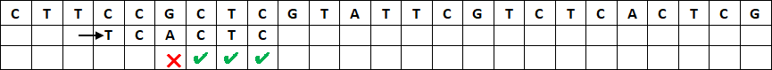
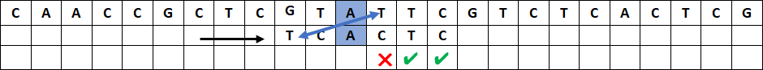
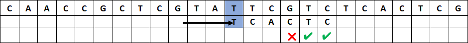

# Recherche textuelle

!!! abstract "Cours" 
    La recherche  textuelle consiste à trouver les occurrences d'une chaîne de caractères, appelée **motif**, ou **clé** dans un texte, appelé **chaine**.  

C’est un problème très fréquent, par exemple quand on fait CTRL+F pour chercher un mot dans un fichier ou sur une page web.  En Python, la recherche textuelle est nativement présente avec les instructions `motif in chaine` ou `chaine.index(motif)` et `chaine.find(motif)`, mais l’optimisation des algorithmes de recherche textuelle est un sujet majeur dans de nombreux domaines.

On étudie dans la suite un cas courant en bio-informatique de recherche dans un brin d’adn : trouver les occurrences de la séquence `TCACTC` (le motif) dans le brin `CTTCCGCTCGTATTCGTCTCACTCG` (la chaine).

##	 Recherche naïve par « force brute »

Il s’agit de faire « glisser » le motif pour parcourir la chaîne caractère après caractère, et de vérifier pour chaque caractère du motif s’il correspond à celui de la chaine. Ce traitement est long mais on est certain d'avoir un bon résultat.

Commençons par aligner le motif à droite de la chaine et par comparer le premier caractère du motif à celui de la chaine :


Le `T` du motif ne correspond pas au `C` de la chaine. On décale le motif d'un caractère à droite et on essaie à nouveau :


Le `T` correspond à celui de la chaine, on compare les caractères suivants à droite : le `C` ne correspond pas au `T`. On décale d’un caractère à droite :


Le `T` et le `C` correspondent à la chaine, mais pas le `A`. On décale d’un caractère :


Le `T` ne  correspond pas au `C` de la chaine. On décale d’un caractère :

L’opération se répète jusqu’à trouver tous les caractères du motif qui correspondent. 


Le traitement est très long car il faut parcourir toute la chaîne, caractère par caractère, et à chaque fois comparer avec un ou plusieurs caractères du motif jusqu’à trouver un caractère qui ne coïncide pas.  Dans le pire des cas, le motif n’est pas présent dans la chaine,  le coût est donc en $O(n \times m)$, où $n$ est la longueur de la chaine et $m$ celle du motif.

Traduit en Python, on obtient le programme suivant :

``` py linenums="1"

chaine = 'CTTCCGCTCGTATTCGTCTCACTCG'
motif = 'TCACTC'


def naive(motif, chaine):
    """ str, str -> list
    Renvoie la liste des positions trouvées du motif dans la chaîne
    """
    positions = []
    n = len(chaine)
    m = len(motif)
    i = 0    # position du début du motif dans la chaine
    while i <= n - m  :
        j = 0       # position du caractère dans le motif
        while j < m and chaine[i + j] == motif[j]:
            j = j + 1
        if j == m:       # on a trouvé le motif
            positions.append(i)
        i = i + 1   # on décale d'un caractère à droite
    return positions

assert naive(motif, chaine) == [18]
assert naive('AAA', 'AAAAA') == [0, 1, 2]
assert naive('AT', 'ATATAT') == [0, 2, 4]
assert naive('AZ', chaine) == []

```

{width="25%" align=right}
{width="25%" align=right}

Attention à prendre soin de terminer la boucle sur le dernier caractère quand `i` vaut `n – m` **inclus**.

On constate que si l’algorithme fonctionne très bien, il est coûteux en temps machine et peut donc être optimisé. 

##	Recherche naïve à rebours

Une première modification consiste à inverser l’ordre des caractères à comparer : on part du dernier caractère du motif et s’il correspond à celui de la chaîne on passe au caractère précédent jusqu’à trouver une discordance ou avoir parcouru l’ensemble du motif (on a alors trouvé le motif).


Le `C` du motif  ne correspond pas au `G` de la chaine, on décale d’un caractère à droite. 


Le `C`  correspond, mais le `T` ne correspond pas au `G` de la chaine, on décale d’un caractère à droite.


Le `C`  ne correspond pas au `T`, on décale d’un caractère à droite.



Le `A`  puis le `T` correspondent à la chaine, mais pas le `C`, on décale d’un caractère à droite,  et ainsi de suite...

On modifie donc le code Python de la façon suivante :

``` py linenums="13"
    while i <= n - m  :
        j = m -  1       # position du caractère dans le motif
        while j >= 0 and chaine[i + j] == motif[j]:
            j = j - 1
        if j == -1:       # on a trouvé le motif
            positions.append(i)
        i = i + 1   # on décale d'un caractère à droite
    return positions
```

La modification n’a pas changé le cout de l’algorithme. Mais alors quel est l’intérêt ?

##	L’algorithme de Horspool

Nigel Horspool propose une version simplifiée de l’algorithme de Boyer-Moore.

Dans la recherche naïve, lorsque que le dernier caractère ne correspond pas à une lettre de la chaîne, on décale le motif d’un caractère, mais on peut faire mieux en regardant si ce caractère de la chaîne est présent autre part dans le motif :


Le `C` ne correspond pas au `G` de la chaine. Plutôt que de décaler le motif d’une seule position vers la droite, on voit qu’il y n’y a pas de  `G`  dans le motif, on peut donc « sauter »  de toute la longueur du motif, et gagner beaucoup de temps :


Le `C` ne correspond pas au `A` de la chaine, mais il y a un `A` dans la chaîne 3 caractères à gauche du dernier caractère du motif, on peut donc aligner immédiatement ce dernier `A` du motif en « sautant »  de 3 caractères :


Le `C` ne correspond pas au `T` de la chaine.  Il y a un `T`dans le motif 5 caractères à gauche du dernier caractère du motif et un autre 1 caractère à gauche. On peut aligner ce dernier  `T` du motif en « sautant » de 1 caractère. 


Le `C` ne correspond pas au `T` de la chaine, mais il y a un `T` dans la chaîne 1 caractère à droite du dernier caractère du motif. On aligne ce `T` du motif en décalant de 1 caractère :


Le `C` et le `T`  correspondent à la chaine, mais ensuite le  `C` ne correspond pas au `G`, on « saute » de 2 caractères pour aligner les `C` :


Le `C`, le `T` et le `C` correspondent, mais pas le `A` au `T` de la chaine, on « saute » de 2 caractères pour aligner les `C` :


Le `C` correspond, mais pas le `T` avec le `A` de la chaine , on « saute » de 2 caractères pour aligner les `C` :


Tous les caractères correspondent. On a trouvé le motif en 8 étapes, au lieu de 18 avec l’algorithme naïf !

On a vu qu’on ne se contente pas de comparer un caractère de la chaine seulement avec le dernier caractère du motif, mais avec l’ensemble des caractères du motif pour déterminer combien de caractères il est possible de faire « glisser » le motif  : un **saut**. 
Mais ce saut est toujours le même pour une même lettre de la chaine que l’on compare au dernier caractère du motif.

Quand cette lettre est un 'T', on fait toujours un saut de 1 caractère :

{height="10%"}


quand c’est un 'C', on saute 2 caractères :

{height="10%"}

Plutôt que de recalculer à chaque fois ce saut quand une lettre ne coïncide pas, on le calcule une seule fois, au début de l’algorithme, les sauts associés à toutes les lettres du motif : c’est un prétraitement de l’algorithme.

!!! abstract "Cours" 
    Prétraitement : Pour chaque lettre du motif (sauf la dernière), le saut à effectuer est égal à l’écart entre la dernière occurrence de cette lettre dans le motif et la fin du motif. On ne calcule pas de saut pour le dernier caractère.

Autrement dit, si une lettre apparaît plusieurs fois dans le motif, on ne garde que la plus à droite. Et le dernier caractère n’est pas pris en compte (puisqu’il aurait un saut de 0).

Exemple, pour le motif  `'TCACTC'`, la table des sauts est :

|A|C|T|autres|
|:-:|:-:|:-:|:-:|
|3|2|1|6|

On peut créer le dictionnaire de sauts suivants : `{'A': 3, 'C': 2, 'T': 1}`.

Ce prétraitement peut s’écrire en Python de la façon suivante :

``` py
def table_sauts(motif):
    dico = {}
    m = len(motif)
    for i in range(m - 1):  # on exclut la derniere lettre du motif
        dico[motif[i]] = m - i - 1
    return dico

```

et le reste de l’algorithme de Horspool :

``` py linenums="1"
def horspool(motif, chaine):
    positions = []
    n = len(chaine)
    m = len(motif)
    sauts = table_sauts(motif) # on construit le dictionnaire « table de saut »
    print(chaine)
    i = 0
    while i <= n - m:
        print(' ' * i + motif)     # affiche le motif aligné avec la chaine
        j = m -  1       # position du caractère dans le motif
        while j >= 0 and chaine[i + j] == motif[j]:
            j = j - 1
        # si on a trouvé le motif
        if j == -1:
            positions.append(i)
            i = i + 1
        # sinon si le dernier caractère est dans la table des sauts
        elif chaine[i + m - 1] in sauts:
            i = i + sauts[chaine[i + m - 1]]   # on saute de la table de sauts
        # sinon
        else:      # le caractère n'est pas dans le motif
            i = i + m    # on saute tout le motif
    return positions
```


## L’algorithme de Boyer-Moore (règle du mauvais caractère)

On peut généraliser l’idée du saut calculé sur la lettre alignée avec le dernier caractère du motif en calculant le saut sur le premier mauvais caractère.

Comme avec Horspool, quand on trouve un caractère qui n’est pas présent dans le motif, on peut décaler derrière celui-ci :


Le `C` ne correspond pas au `G` de la chaine. Il y n’y a pas de `G`  dans le motif, on décale de toute la longueur du motif :


Le `C` ne correspond pas au ‘A’ de la chaine, mais il y a un ‘A’ dans la chaîne 5 caractères à droite du dernier caractère du motif et un autre 3 caractères à droite. On peut aligner ce dernier  ‘A’ du motif en décalant de 3 caractères.



Le `C` et le `T` correspondent, mais pas le `C`  avec le `T` de la chaine. Plutôt que de calculer le saut en fonction du `C` comme avec Horspool, c’est-à-dire un saut de 2 caractères,  on utilise le premier mauvais caractère, ici `T`. Il y a un `T` dans le motif à gauche du mauvais caractère, on peut aligner ces `T` et  sauter de 3 caractères.  Attention, on ne prend pas en compte le `T` dans le motif à droite du mauvais caractère.

C’est comme si on calculait la table des sauts pour un motif réduit `TCAC` :

|A|C|T|autres|
|:-:|:-:|:-:|:-:|
|1|2|3|4|




Le `C`  et le `T` correspondent, mais pas le `C` avec le `G` de la chaine.  Il n’y a pas de `G` dans la partie droit du motif,  (il n’y en a pas du tout), on decale après ce `G` de 4 caractères.


Le `C` correspond, mais  pas le  `T` au `C`. Le mauvais caractère est un `A`, et il y a un `A` à droite du mauvais caractère ,  on decale de 2 caractères pour aligner les `A`. 


Tous les caractères correspondent. On a trouvé le motif en 7 étapes, au lieu de 8 avec Horspool !

L’algorithme de Boyer-Moore consiste donc à examiner la chaîne en partant du bout du motif et en remontant les caractères du motif un par un jusqu'à trouver une discordance :

- 	si la lettre de la chaîne examinée est identique à celle du motif on remonte  le motif d'un cran
- 	si la lettre de la chaîne examinée est en discordance avec celle du motif on regarde si cette lettre existe dans le motif _parmi les caractères non examinés_. 
    -	si elle existe, on réalise un saut correspondant;
    -	si elle n'existe pas,  on saute au-delà de la cette dernière position examinée.

A la différence de Horspool, les sauts ne dépendent pas que de la lettre qui ne coïncide pas, mais aussi de la position de cette lettre.  La table des sauts a donc deux entrées : les caractères du motif et la position j dans le motif à laquelle se trouve la discordance :

-	Pour `j = 5`, les sauts sont calculés sur la position du dernier caractère du motif, on retrouve les sauts de Horspool.

-	Pour les autres valeurs de j, il faut calculer les sauts sans prendre en compte les caractères qui coïncident, par exemple pour `j = 3`, les sauts correspondent aux sauts Horpsool pour le motif  `TCAC`, c’est-à-dire en ignorant les derniers caractères `TC` (puisqu’ils coïncident avec la chaîne).

-	Certaines valeurs ont un `X` pour les caractères qui correspondent au motif (ce n’est pas un mauvais caractère). 

|j(lettre)|A|C|T|autres|
|:-:|:-:|:-:|:-:|:-:|
|0 (T)|1|1|X|1|
|1 (C)|2|X|1|2|
|2 (A)|X|1|2|3|
|3 (C)|1|X|3|4|
|4 (T)|2|1|X|5|
|5 (C)|3|X|1|6|


En Python, on peut construire cette table des sauts avec un tableau de dictionnaire :

``` py
[{},
 {'T': 1},
 {'C': 1, 'C': 2},
 {'A': 1, 'T': 3},
 {'A': 2, 'C': 1},
 {'A': 3, 'T': 1}]
```
L'algorithme de Boyer-Moore dépasse le niveau attendu en Terminale NSI. 

``` py linenums="1"
def table_sauts_bm(motif):
    """ str -> list(dict)
    Renvoie un tableau de dictionnaires de sauts pour les valeurs de j
    """
    tab = []
    for j in range(len(motif)):
        tab.append(table_sauts(motif[:j+1]))
    return tab

def boyer_moore(motif, chaine):
    positions = []
    n = len(chaine)
    m = len(motif)
    sauts = table_sauts_bm(motif) # on construit le dictionnaire « table de saut »
    print(chaine)
    i = 0
    while i <= n - m: # On ne peut pas utiliser la boucle for avec les sauts
        print(' ' * i + motif)     # affiche le motif aligné avec la chaine
        j = m - 1   # position du caractère dans le motif
        coincide = 0
        while j >= 0 and chaine[i + j] == motif[j]:
            j = j - 1
        # si on a trouvé le motif
        if j == -1:
            positions.append(i)
            i = i + 1
        # sinon si le mauvais caractère est dans le motif
        elif chaine[i + j] in sauts[j]:    #
            i = i + sauts[j][chaine[i + j]]    # on saute de la table de sauts
        else:                # le caractère n'est pas dans le motif
            i = i + j + 1    # on saute tout le motif
    return positions
```

L'algorithme complet de Boyer-Moore ajoute une règle du “bon suffixe” qui n’a pas été présentée ici.


On peut regarder l’animation de [http://fred.boissac.free.fr/AnimsJS/recherchetextuelle/index.html](http://fred.boissac.free.fr/AnimsJS/recherchetextuelle/index.html)