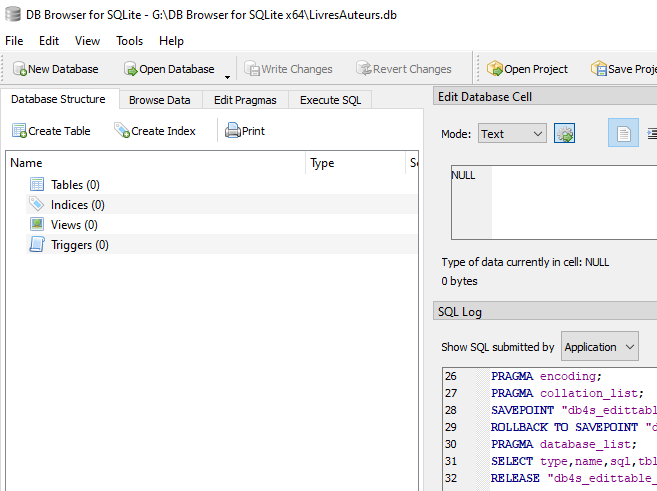
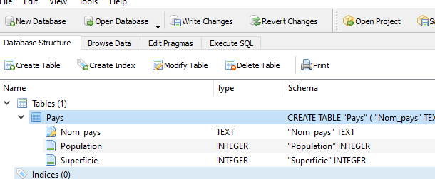
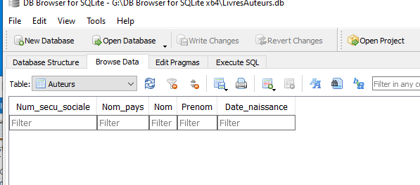
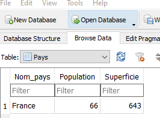
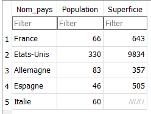

# Le langage SQL


!!! abstract "Cours"
    L’interaction avec un SGBD se fait dans un language informatique dédié appelé **Structured Query Langage** ou **SQL**. 

SQL est un langage déclaratif, il n'est donc pas a proprement parlé un langage de programmation, mais plutôt une interface standard pour accéder aux bases de données.


Commençons par créer une nouvelle base de données (menu « `New Database` ») enregistrée sous le nom « `LivresAuteurs.db` ». La base de données vide s’ouvre :

{width="80%"}


##	Création des tables, mise à jour et suppression des tables

Créons une première table qui représente la relation: `Pays({++Nom_pays++}, Population, Superficie)`.


!!! abstract "Cours"
    La commande SQL pour créer une table est : 

    ``` sql
    CREATE TABLE nom_table( 
        nom_colonne1 	domaine1, 
        nom_colonne2	domaine2,
        …
    )
    ```

{width="40%" align=right}


Entrons la commande SQL suivante dans l’onglet « `Execute SQL` » :

``` sql
CREATE TABLE Pays (
	Nom_pays	TEXT,
	Population	INTEGER,
	Superficie	INTEGER,
	PRIMARY KEY(Nom_pays)
);
```

À noter : 
>  Le langage SQL n’est pas sensible à la casse, mais les requêtes SQL sont écrites en majuscule par convention.

Puis le bouton «`run`» :arrow_forward: pour exécuter la commande :

{width="40%" align=left}

La table créée apparaît dans l'onglet « `Database Structure` » avec ses colonnes. 


Noter l’icone devant `Nom_pays` indiquant la clé primaire.

SQLite permet de générer automatiquement les requêtes pour créer les tables suivantes avec le menu « `Create Table` ».

Maintenant que la table `Pays` a été créée, il est possible d'ajouter la table `Auteur({++Num_auteur++}, #Nom_pays, Nom, Prenom, Date_naissance)`. Il n'était pas possible de crééer la table `Auteur` avant `Pays` car elle contient un clé étrangère (`Nom_ Pays`) qui fait référence à `Pays` (**contrainte d'intégrité référentielle**).

!!! abstract "Cours"

    Contrainte d'intégrité référentielle : Pour créer une nouvelle table contennatt une clé étrangère en référence à une autre table, il faut que cette autre table ait **déjà été créée avant**.


- Saisir le nom de la table (`Auteur`), les noms colonnes (`Num_auteur`, `Nom_pays`, `Nom`, `Prenom`, `Date_naissance`), leur domaine respectifs (`INTEGER`, `TEXT`, `TEXT`, `TEXT`, `NUMERIC`).

- Indiquer que la colonne `Nom` est une clé primaire en cliquant la case « `PK` » (pour *Primary Key*). Il est aussi possible de cliquer sur « `NN` » pour *Not Null* et « `U` » pour *Unique*. 

- Indiquer que la colonne `Nom_pays` est une clé étrangère dans  « `Foreign Key` » en indiquant la référence vers l'attribut `Nom_pays` de la table  `Pays`.

A noter :
> Les domaines proposés par SQLite (dépendent du SGBD) sont INTEGER pour les entiers, TEXT  pour les chaînes de caractères, BLOB pour *binary large object*, REAL pour le flottants et enfin NUMERIC qui convertit en l’un des types précédents en fonction de la valeur donnée.

>    Il est possible d'ajouter des contraintes d’intégrité : 
     `ON UPDATE CASCADE` si un nom est modifié dans la table des pays alors cela est répercutée dans Auteurs, 
     `ON DELETE CASCADE` si un pays est supprimé alors les auteurs correspondants seront supprimés.


La commande SQL est générée automatiquement :

``` sql
CREATE TABLE "Auteur" (
	"Num_auteur"	INTEGER NOT NULL UNIQUE,
	"Nom_pays"	TEXT,
	"Nom"	TEXT,
	"Prenom"	TEXT,
	"Date_naissance"	NUMERIC,
	FOREIGN KEY("Nom_pays") REFERENCES "Pays"("Nom_pays") ON UPDATE CASCADE ON DELETE CASCADE ,
	PRIMARY KEY("Num_auteur")
); 
```


De la même façon, créons la table `Livres({++No_ISBN++}, Titre, Annee)`, par exemple en précisant le domaine avec une contrainte utilisateur supplémentaire (menu « `Check` » ) afin que l’année soit un entier entre 1900 et 2100.

``` sql
CREATE TABLE "Livre" (
	"Num_ISBN"	TEXT,
	"Titre"	TEXT,
	"Editeur"	TEXT,
	"Annee"	INTEGER NOT NULL CHECK("Annee" BETWEEN 1900 AND 2100),
	PRIMARY KEY("Num_ISBN")
);
```

Finalement ajoutons la table `Ecrit({++#No_ISBN++}, {++#Num_secu_sociale++})` :

``` sql
CREATE TABLE "Ecrit" (
	"Num_ISBN"	TEXT,
	"Num_auteur"	INTEGER,
	FOREIGN KEY("Num_auteur") REFERENCES "Auteur"("Num_auteur"),
	FOREIGN KEY("Num_ISBN") REFERENCES "Livre"("Num_ISBN"),
	PRIMARY KEY("Num_auteur","Num_ISBN")
);
```


!!! abstract "Cours"
    La commande SQL `CREATE TABLE` permet de renseigner les clés primaires et étrangères d'uen table :

    ``` sql
    CREATE TABLE nom_table( 
        nom_colonne1	domaine1, 
        nom_colonne2	domaine2,
        …
        PRIMARY KEY(cle_primaire_1, cle_primaire_2, …)    
        FOREIGN KEY(cle_etrangere_1) REFERENCES nom_table(cle_etrangere_1),
    …)
    ```

Les commandes `ALTER TABLE` et `DROP TABLE` permettent de modifier ou supprimer une table. 

- 	Admettons qu’on veuille changer la base de données pour ne plus enregistrer les pays : 

```sql
DROP TABLE Pays
```

- 	Pour le chapitre suivant, on va supprimer la colonne Date_naissance :

``` sql
ALTER TABLE Auteurs DROP COLUMN Date_naissance
```

Le schéma de base de données complet a été créé, il peut être enregistré (menu  « `File/Save All` »).


## 	Insérer des données avec `INSERT`

Le schéma de notre base de données a maintenant été créée dans le SGBD, mais à ce stade elle est complétement "vide", elle ne contient aucune données. Autrement dit les tables et les colonnes sont bien renseignées mais il n'y a aucune ligne. C'est ce que l'on observe dans l’onglet « `Browse Data` ».

{width="60%" }


La mise à jour la base de données se fait à travers le SGBD par le biais de commandes SQL. Le SGBD garantit que les mises à jour respectent le schéma et les contraintes d'intégrité de la base de données.


!!! abstract "Cours"
    La commande SQL pour insérer des données est :

    ``` sql
    INSERT INTO nom_table 
    VALUES (valeur_1,  valeur_2, …)
    ```

Entrons la commande SQL dans l’onglet « `Execute SQL` » :

``` sql
INSERT INTO Pays VALUES ("France", 66, 643) 
```

et observons le résultat dans « `Browse Data` » : 

{width="30%" }

Il est aussi possible d'utiliser `INSERT INTO` pour insérer plusieurs lignes en même temps : 

``` sql
INSERT INTO Pays
VALUES 
("Allemagne", 83, 357),
("Espagne", 46, 505);
```
ou encore d'utiliser `INSERT INTO` en précisant les colonnes, par exemple pour les renseigner dans un ordre différent :

``` sql
INSERT INTO Pays(Population, Superficie, Nom_pays)
VALUES (330, 9834, "Etats-Unis"); 
```
ou de ne renseigner que certaines colonnes :
``` sql
INSERT INTO Pays(Nom_pays, Population)
VALUES ("Italie", 60);
``` 

{width="30%" }

Observons ce qui se passe si on essaie d’insérer un doublon, c’est-à-dire une ligne avec une clé primaire déjà existante, ici `Nom_pays("France")` :

``` sql
INSERT INTO Pays VALUES ("France", 67, 640) ;
```

Le SGBD génère une erreur pour violation de la contrainte d’entité : 
``` sql
Execution finished with errors.
Result: UNIQUE constraint failed: Pays.Nom_pays
At line 1:
INSERT INTO Pays VALUES ("France", 67, 640);
```


!!! abstract "Cours"
    Contrainte d’entité : Il n'est pas possible d'insérer deux lignes avec la même valeur de clé primaire (ou la même combinaison de clés primaires) dans une table.


Insérons maintenant un premier auteur :

``` sql
INSERT INTO Auteur
VALUES (0, "Etats-Unis", "Twain", "Mark");
```

et un livre :

``` sql
INSERT INTO Livre VALUES ("978-2228887359","A la dure II", "Payot", 1993);
INSERT INTO Ecrit VALUES ("978-2228887359", 0);
```

Le SGBD teste toutes les contraintes d’intégrité. Par exemple si la valeur de la colonne `Annee` d’un livre n’est pas compris entre 1900 et 2100 :

``` sql
INSERT INTO Livre VALUES ("0000-00001","Livre trop vieux", "", 1890);
```

ou si une clé étrangère n’existe pas : 

``` sql
INSERT INTO Auteur VALUES (1, "Russie", "Asimov", "Isaac");
```

!!! abstract "Cours"
    Contrainte d’intégrité référentielle : Il n'est pas possible d'insérer une ligne dans une table avec une valeur de clé étrangère qui n’existe pas dans la table à laquelle elle fait référence.


Pour la suite du chapitre, importons des données plsu complètes (25 lignes de Pays, 119 auteurs et 129 livres) dans la base de données à partir du fichier [« `LivresAuteurs.sql` »](assets/LivresAuteur.sql).


##	Mettre à jour des données avec `UPDATE`

Admettons que la population de la ligne `France` a changée et qu'elle doit être mise à jour dans la base de données : 

``` sql
UPDATE Pays 
SET Population = 67 
WHERE Nom_Pays = "France";
```

!!! abstract "Cours"
    La commande SQL pour mettre à jour des données est :

    ``` sql
    UPDATE nom_table 
    SET  nom_colonne1 = nouvelle_valeur
    WHERE nom_colonne2 =  identifiant
    ```

    :warning: Il ne faut pas oublier de préciser la ligne ou les lignes à modifier avec la clause `WHERE` au rique de modifier toutes les lignes de la table avec la `nouvelle_valeur`.
    

!!! question "Exercice corrigé"
    Certains livres de la base de données ont pour éditeur LGF/ Le Livre de Poche et d’autres Le Livre de Poche. Quelle commande permet de tous les réunir sous un même nom d’éditeur ?.

    
??? Success "Réponse"
    UPDATE Livre SET Editeur = "Le Livre de Poche" WHERE Editeur = "LGF/Le Livre de Poche"

## Supprimer des données avec `DELETE`

!!! abstract "Cours"
    La commande SQL pour supprimer des données est :

    ``` sql
    DELETE FROM nom_table  
    WHERE nom_colonne =  identifiant
    
    ```

Imaginons que l’on veuille supprimer un livre ainsi que son auteur s’il n’a pas écrit d’autres livres dans la base de données. Par exemple le livre Akira dont l’ISBN est 978-2723428262. 

Commençons par supprimer ce livre dans la table `Livre`: 

``` sql
DELETE FROM Livre WHERE Num_ISBN = '978-2723428262';
```

Cette commande renvoie une erreur :
``` sql
Result: FOREIGN KEY constraint failed
```

et c'est la même chose si on essaye de supprimer cet auteur de la table `Auteur` :

``` sql
DELETE FROM Auteur WHERE Num_auteur = 2;
```


en effet, ces deux commandes violent la contrainte d'intégrité référentielle sur la table `Ecrit`.
Il faut procéder dans l’ordre et commencer par supprimer les lignes des autres tables qui font référence à ce livre ou à cet auteur, ici il y a une ligne dans la table `Ecrit` qui leur fait référence : 

``` sql
DELETE FROM Ecrit WHERE Num_ISBN = '978-2723428262';
DELETE FROM Livre WHERE Num_ISBN = '978-2723428262';
DELETE FROM Auteur WHERE Num_auteur = 2;
```

!!! abstract "Cours"
    Contrainte d’intégrité référentielle : Il n'est pas possible de supprimer une ligne dans une table si elle est référencée par la clé étrangère d'une autre table. 

##	Interroger des données avec `SELECT`

Une façon simple de connaître tous les livres de la base de données est la commande (ou **requête** pour une interrogation de la base de données) suivante :

``` sql
SELECT * FROM Livre ;
```

Elle affiche toute la table. Pour voir seulement certaines colonnes, par exemple les titres et éditeurs des livres,  il faut écrire la requête :

``` sql
SELECT Titre, Editeur FROM Livre; 
```


!!! abstract "Cours"
    La commande (ou **requête**) SQL pour intérroger des données est :

    ``` sql
    SELECT * FROM nom_table
    ```

    ou 

    ``` sql
    SELECT nom_colonne_1, nom_colonne_1 
    FROM nom_table 
    ```

Il est aussi possible de changer l'affichage du nom des colonnes en leur donnant un alias avec `AS`

``` sql
SELECT Titre AS "Titre du livre", Editeur 
FROM Livre; 
```

### avec `WHERE` 

!!! abstract "Cours"
    La clause WHERE suivi d’une condition permet de restreindre le champ de recherche d'une requête ::

    ``` sql
    SELECT * FROM nom_table
    WHERE nom_colonne1 = valeur
    ```


Recherchons par exemple les livres publiés chez l'éditeur "J'ai Lu" :

``` sql
SELECT * FROM Livre 
WHERE Editeur="J'ai Lu";
```

ou tous les livres publiés après 1990 :
``` sql
SELECT * FROM Livre 
WHERE Annee > 1990;
``` 

il n'est pas possible de mettre plusieurs clauses `WHERE` dans une requête, pour des requêtes plus compliquées il faut uiliser les opérateurs booléens  `AND ` et `OR`, par exemple les livres publiés entre 1990 et 2000, ou les livres publiés en 1990 ou 2000 :


``` sql
SELECT * FROM Livre WHERE Annee >= 1990 AND Annee <= 2000;    
SELECT * FROM Livre WHERE Annee = 1990 OR Annee = 2000;    
``` 

De nombreuses autres possibilités existent pour affiner les requêtes, par exemple utiliser des clauses "floues" avec `LIKE`, `NOT LIKE` et le symbole `%` ou encore `IN` (hors programme):

``` sql
SELECT * FROM Livre WHERE Titre LIKE "%Astérix%";
SELECT * FROM Livre WHERE Num_ISBN NOT LIKE '978%';
SELECT * FROM Livre WHERE Editeur IN ("J'ai Lu", "Flammarion");
```

### avec `DISTINCT` et  `ORDER BY`

Recherchons tous les éditeurs de la table `Livre` :

``` sql
SELECT Editeur
FROM Livre;
```
Certains éditeurs apparaîssent plusieurs fois quand ils ont édités plusieurs livres. Pour éviter ces répétitions il faut utiliser la clause `DISTINCT` :

``` sql
SELECT DISTINCT Editeur
FROM Livre;
```
De la même façon, `ORDER BY` permet de trier les résultats d'une requête selon une colonne :

``` sql
SELECT Nom_pays, Population
FROM Pays 
ORDER BY Population ;
``` 
Le tri se fait par défaut en ordre croissant, mais il est possible de préciser l'ordre voulu, `ASC` pour l'ordre croissant ou `DESC` pour l'ordre décroissant : 

``` sql
SELECT Nom_pays, Population
FROM Pays 
ORDER BY Population DESC ; 
``` 


!!! abstract "Cours"
    La clause `DISTINCT` permet d'éviter le répétition dans une requête :
    
    ``` sql
    SELECT DISCTINCT nom_colonne
    FROM nom_table 
    ```

    La clause `ORDER BY` permet de trier le resultat d'une requête en ordre croissant (`ASC` par défaut) ou decroissant (`DESC`) :

    ``` sql
    SELECT nom_colonne1, nom_colonne2
    FROM nom_table 
    ORDER BY nom_colonne
    ```


### avec des fonctions d'aggrégation `MIN()`, `MAX()`, `COUNT()`, `SUM()` et `AVG()`

!!! abstract "Cours"
    Les fonctions d’agrégation `MIN()`, `MAX()`, `COUNT()`, `SUM()` et `AVG()` permettent d’effectuer des opérations statistiques dans une requête : 

    ``` sql
    SELECT MIN(nom_colonne)
    FROM Nom_table 
    ```
    

En voici quelques exemples :

``` sql
SELECT COUNT(Titre) FROM Livre;
SELECT COUNT(Editeur) FROM Livre; 
SELECT MIN(Population) AS Minimum FROM Pays;
SELECT MIN(Population) AS Min, MAX(Population) as Max, AVG(Population) AS Moyenne FROM Pays ;
```

`GROUP BY` (hors programme) permet de regrouper certains résultats ensembles :
``` sql
SELECT Editeur, COUNT(Editeur) FROM Livre GROUP BY Editeur;
SELECT Nom_pays, COUNT(Nom_pays) FROM Auteur GROUP BY Nom_pays;
```

###	Requêtes imbriquées (ou sous-requêtes)
Une requête du type`SELECT… FROM …` renvoie une table comme résultat. Cette table peut tout à fait être utilisée pour écrire de nouvelles requêtes.

Comment trouver le nom du pays qui a la plus petite population ? 

La plus petite population parmi la table `Pays` est  obtenue par :

```sql
SELECT MIN(Population) FROM Pays;
```
Le resultat de cette requête peut alors être utilisé comme une sous-requête de :
``` sql
SELECT Nom_Pays, Population 
FROM Pays
WHERE Population = (SELECT MIN(Population) FROM Pays);
```

:warning: SQLite est particulièrment flexible avec les fonctions d'aggregation et permettait d’écrire directement :

``` sql
SELECT Pays, MIN(Population) 
FROM Pays
```
Mais ce n’est pas le cas de tous les SGBD. Il suffit de tester la requête suivante pour comprendre que cette flexibilité est souvent à éviter !

``` sql
SELECT Pays, MIN(Population), MAX(Population) 
FROM Pays
```

## Jointures
La requête `SELECT * FROM Ecrit` nous renvoie la table des `Num_auteur` avec les `Num_ISBN` correspondant, mais comment afficher le nom et prénom de l’auteur, plutôt que son numéro ?

Il faut croiser les informations provenant des tables `Ecrit` et `Auteur` ensembles. C’est une **jointure**.

{width="80%"}
{width="80%"}


!!! abstract "Cours"
    Pour sélectionner des données à travers plusieurs tables, il faut réaliser une jointure entre les tables avec `JOIN... ON...`
    ``` sql
    SELECT nom_table1.nom_colonne1, nom_table2.nom_colonne2 
    FROM nom_table1
    JOIN nom_table2 
    ON nom_table1.cle1 = nom_table2.cle_2

Ce qui donne dans notre exemple :
``` sql
SELECT Ecrit.Num_ISBN, Auteur.Nom, Auteur.Prenom 
FROM Ecrit
JOIN Auteur
ON Ecrit.Num_auteur = Auteur.Num_auteur ;
```

Noter que `JOIN` a remplacé l’ancienne syntaxe pour les jointures avec `WHERE`  :
``` sql
SELECT nom_table1.nom_colonne1, nom_table2.nom_colonne2 
FROM nom_table1, nom_table2
WHERE nom_table1.cle1 = nom_table2.cle2
```

Ce qui donnait dans notre exemple :
```
SELECT Num_ISBN, Nom, Prenom 
FROM Ecrit, Auteur
WHERE Ecrit.Num_auteur = Auteur.Num_auteur ;
```

Quand il n’y a pas d’ambiguïté sur les noms de colonne entre les deux tables, par exemple ici `Num_ISBN` n’apparaît que dans `Ecrit` et `Nom` et `Prenom` que dans `Auteur`, il est possible d’écrire plus simplement :
``` sql
SELECT Num_ISBN, Nom, Prenom 
FROM Ecrit
JOIN Auteur
ON Ecrit.Num_auteur = Auteur.Num_auteur ;
```

Dans le cas où on utilise les noms de tables, l’utilisation des alias est particulièrement recommandée ici :
``` sql
SELECT E.Num_ISBN, A.Nom, A.Prenom 
FROM Ecrit AS E
JOIN Auteur AS A 
ON E.Num_auteur = A.Num_auteur ;
```

Il est aussi possible d'ajouter des clauses, par exemple pour les auteurs françqis seulement.
``` sql
SELECT Ecrit.Num_ISBN, Auteur.Nom, Auteur.Prenom 
FROM Ecrit
JOIN Auteur 
ON Ecrit.Num_auteur = Auteur.Num_auteur
WHERE Auteur.Nom_pays = "France" ;
```

Enfin, les noms des livres et de leurs auteurs de la table `Ecrit` s'obtiennent par une **double jointure**.
``` sql
SELECT L.Titre, A.Nom, A.Prenom 
FROM Ecrit AS E
JOIN Auteur AS A 
ON E.Num_auteur = A.Num_auteur
JOIN Livre AS L 
ON E.Num_ISBN = L.Num_ISBN;
```

## Autres types de jointures (hors programme)
La jointure JOIN, aussi appelée INNER JOIN réunit seulement les lignes qui apparaissent dans les deux tables.

{width="80%"}
{width="80%"}

L’ordre des tables n’a pas d’importance. On peut donc aussi écrire :
=== "avec `...FROM Ecrit JOIN Auteur`"
    ``` sql
    SELECT E.Num_ISBN, A.Nom, A.Prenom 
    FROM Ecrit AS E
    JOIN Auteur AS A
    ON E.Num_auteur = A.Num_auteur	
    ``` 

=== "avec `...FROM Auteur JOIN Ecrit`"
    ``` sql
    SELECT E.Num_ISBN, A.Nom, A.Prenom 
    FROM Auteur AS A
    JOIN Ecrit AS E
    ON E.Num_auteur = A.Num_auteur
    ```

Le résultat est le même.

Il existe d’autres types de jointures, `LEFT JOIN`, `RIGHT JOIN`, `FULL OUTER JOIN` (hors programme) qui permettent d’obtenir des résultats différents.

{width="80%"}
{width="80%"}

{width="80%"}
{width="80%"}

{width="80%"}
{width="80%"}