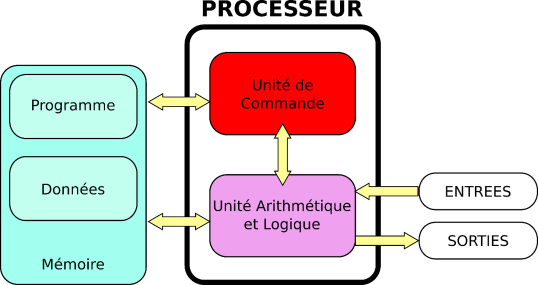

# Calculabilité, Programme en tant que donnée, Problème de l’arrêt

## Dualité entre programme et donnée

{width="30%" align=right}

On a vu en classe de première avec l’architecture von Neumann que les données et les programmes sont stockés ensembles dans la mémoire de l’ordinateur. Rien n’empêche donc un programme de produire ou d’utiliser le code d’un autre programme pour le lire ou l’exécuter. 

!!! abstract "Cours" 
    La dualité entre programme et données est un concept fondamental en informatique : les programmes sont des données comme les autres et les données peuvent aussi être des programmes. .

